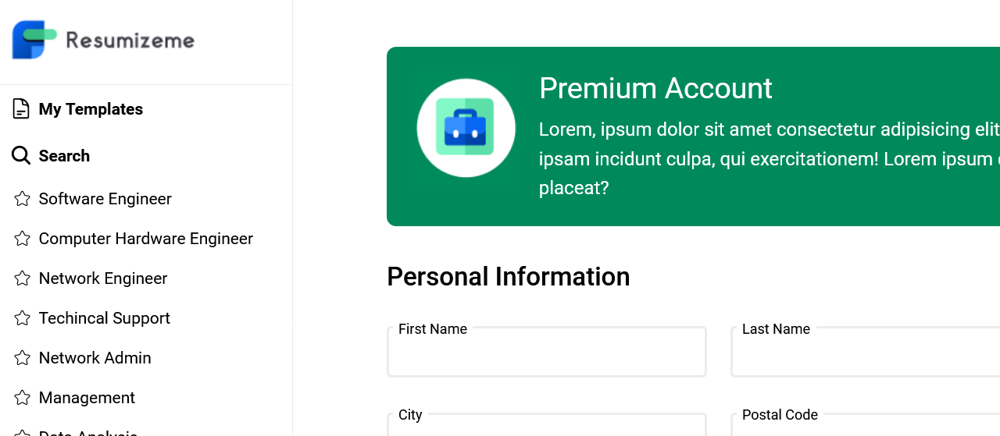
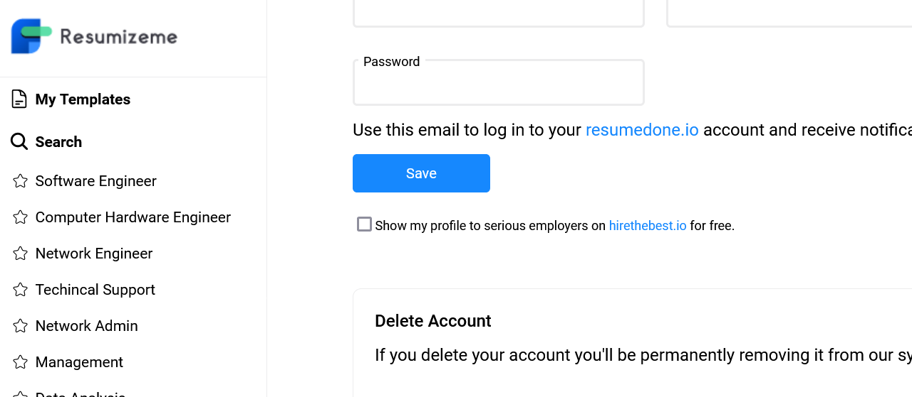

# Resume Example

A static user profile form created using HTML, CSS, and React. The form should allow users to input their personal information and update their profile details when wired up with backend.

## Usage
1. cd in to the project and Install dependencies:
```sh
npm install
```
2. Start the development server:
```sh
npm run dev
```
3. Open your browser and navigate to [http://localhost:5173](http://localhost:5173).

## Screenshot

